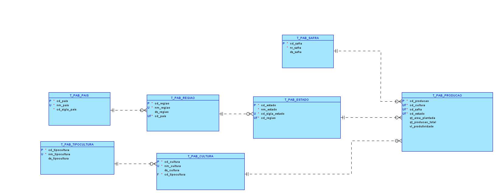
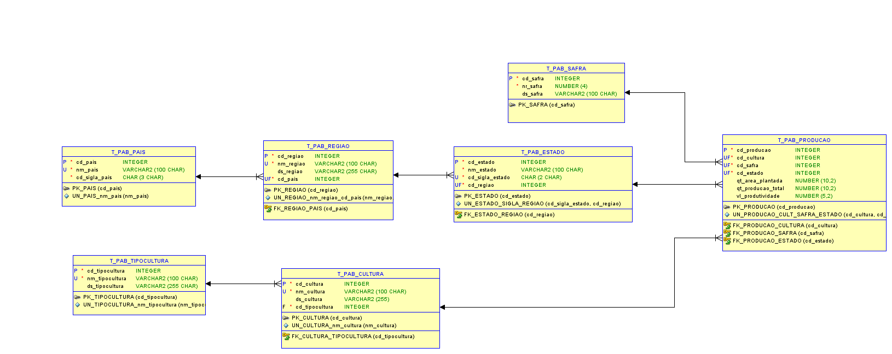

# FIAP - Faculdade de Informática e Administração Paulista

<p align="center">
<a href= "https://www.fiap.com.br/"></a>
</p>

<br>

# Projeto: Modelo de Banco de Dados Agrícola

## 👨‍🎓 Integrantes: 
- <a href="https://www.linkedin.com/in/joseandrefilho">Jose Andre Filho</a>

## 👩‍🏫 Professores:
### Tutor(a) 
- <a href="https://www.linkedin.com/in/lucas-gomes-moreira-15a8452a/">Lucas Gomes Moreira</a>
### Coordenador(a)
- <a href="https://www.linkedin.com/in/profandregodoi/">André Godoi Chiovato</a>


## Objetivo
Desenvolver um modelo de banco de dados normalizado que armazene e analise informações sobre a produção agrícola no Brasil. Os dados utilizados são oriundos do CONAB. O objetivo principal é criar um modelo que seja eficiente, estruturado e que permita consultas úteis para análise da produção agrícola por estado, safra e cultura.

## 📁 Estrutura de pastas

Dentre os arquivos e pastas presentes na raiz do projeto, definem-se:

- **assets**: Contém imagens e outros arquivos de mídia não estruturados relacionados ao projeto.
- **mer**: Diretório que contém o arquivo do Modelo Entidade Relacionamento (MER), Diagrama Entidade Relacionamento (DER) e o arquivo de Definição de Dados (DDL), gerados pela ferramenta **Oracle SQL Developer Data Modeler**.
- **README.md**: Arquivo de guia e explicação geral sobre o projeto (este que você está lendo agora).

## Estrutura do Projeto
Este projeto foi desenvolvido utilizando o Oracle Data Modeler para a modelagem do banco de dados e o Oracle SQL para a criação das tabelas e consultas. A seguir, são descritas as etapas e entregáveis:

### 1. Escolha dos Dados
Os dados escolhidos foram a série histórica de produção de grãos por estado, disponibilizada pela CONAB. Os dados incluem informações como área plantada, produção total, produtividade e estado para diversas culturas agrícolas.

### 2. Modelo Entidade-Relacionamento (MER)
O MER foi criado com as seguintes entidades principais:
- **t_pab_cultura**: Armazena informações sobre as culturas agrícolas (e.g., milho, soja).
- **t_pab_estado**: Armazena informações sobre os estados brasileiros.
- **t_pab_pais**: Armazena informações sobre os países (focado no Brasil).
- **t_pab_producao**: Armazena informações detalhadas sobre a produção de culturas agrícolas em estados específicos.
- **t_pab_regiao**: Armazena informações sobre as regiões do Brasil.
- **t_pab_safra**: Armazena informações sobre as safras agrícolas.
- **t_pab_tipocultura**: Armazena informações sobre os tipos de cultura (e.g., grãos, frutas).

### 3. Aplicação das Regras de Normalização
- **Primeira Forma Normal (1FN)**: Garantiu-se que todos os atributos são atômicos e não há grupos repetitivos.
- **Segunda Forma Normal (2FN)**: Todos os atributos não chave dependem completamente da chave primária.
- **Terceira Forma Normal (3FN)**: Eliminaram-se dependências transitivas para garantir que os atributos dependam apenas da chave primária.

### 4. Conversão para o Modelo Lógico Relacional
O modelo foi convertido utilizando o Oracle Data Modeler para criar tabelas relacionais que representam as entidades e seus relacionamentos. As tabelas incluem constraints como chaves primárias e estrangeiras para manter a integridade referencial.

### 5. Padronização de Nomenclatura
Foram seguidas as seguintes convenções:
- Prefixos como `cd_`, `nm_`, `ds_` para identificar colunas (código, nome, descrição, etc.).
- Constraints foram padronizadas como:
  - `pk_` para chaves primárias.
  - `fk_` para chaves estrangeiras.
  - `un_` para constraints de unicidade.

### 6. Código SQL para Criação das Tabelas
O código SQL foi desenvolvido para criar todas as tabelas e definir constraints de integridade. Os scripts estão disponíveis no repositório do GitHub, na pasta `mer/`.

### 7. Consultas SQL para Análise
Foram desenvolvidas as seguintes consultas para análise de dados:
- **Produção total** de uma cultura por estado em uma safra específica.
- **Evolução da área plantada** de uma cultura ao longo dos anos.
- **Ranking dos estados** com maior produtividade em uma cultura específica.

### Consultas SQL para Análise de Dados Agrícolas

#### 1. Produção total de uma cultura por estado em uma safra específica

```sql
SELECT e.nm_estado, c.nm_cultura, SUM(p.qt_producao_total) AS total_producao
FROM t_pab_producao p
JOIN t_pab_estado e ON p.cd_estado = e.cd_estado
JOIN t_pab_cultura c ON p.cd_cultura = c.cd_cultura
WHERE p.cd_safra = :safra_id
AND p.cd_cultura = :cultura_id
GROUP BY e.nm_estado, c.nm_cultura;
```

##### Explicação:
Explicação:
Esta consulta retorna a **produção total** de uma cultura específica por *estado* em uma *safra* específica.
Filtra os dados por `cd_safra` e `cd_cultura`, permitindo analisar uma safra e uma cultura específicas.
Utiliza a função `SUM` para calcular a produção total de cada estado.

### Exemplo de Resultado:

| nm_estado        | nm_cultura | total_producao |
|------------------|------------|----------------|
| São Paulo        | Soja       | 3000.50        |
| Rio Grande do Sul| Soja       | 2500.00        |
| Minas Gerais     | Soja       | 2000.75        |
| Paraná           | Soja       | 1800.30        |
| Bahia            | Soja       | 1600.45        |

---

#### 2. Evolução da área plantada de uma cultura ao longo dos anos

```sql
SELECT s.nr_safra, SUM(p.qt_area_plantada) AS total_area_plantada
FROM t_pab_producao p
JOIN t_pab_safra s ON p.cd_safra = s.cd_safra
WHERE p.cd_cultura = :cultura_id
GROUP BY s.nr_safra
ORDER BY s.nr_safra;
```

##### Explicação:
Esta consulta mostra a **evolução da área plantada** de uma cultura específica ao longo dos anos, permitindo analisar o comportamento dessa variável ao longo do tempo.
Agrupa e ordena os dados por `nr_safra` para mostrar a área plantada em cada ano de forma cronológica.
Filtra os resultados por `cd_cultura`, permitindo observar a evolução específica para uma cultura.

### Exemplo de Resultado:

| nr_safra | total_area_plantada |
|----------|---------------------|
| 2020     | 5000.00             |
| 2021     | 5300.25             |
| 2022     | 6000.75             |
| 2023     | 6500.50             |
| 2024     | 6800.30             |

---

#### 3. Ranking dos estados com maior produtividade em uma cultura específica (independente da safra)

```sql
SELECT e.nm_estado, c.nm_cultura, AVG(p.vl_produtividade) AS produtividade_media
FROM t_pab_producao p
JOIN t_pab_estado e ON p.cd_estado = e.cd_estado
JOIN t_pab_cultura c ON p.cd_cultura = c.cd_cultura
WHERE p.cd_cultura = :cultura_id
GROUP BY e.nm_estado, c.nm_cultura
ORDER BY produtividade_media DESC;
```

##### Explicação:
Esta consulta gera um *ranking de produtividade média* por estado para uma cultura específica ao longo de todas as safras.
Utiliza a função `AVG` para calcular a média de produtividade `(vl_produtividade)` para cada estado, considerando todas as safras disponíveis.
Filtra por `cd_cultura` para focar em uma cultura específica e ordenar os estados em ordem decrescente de produtividade média.

### Exemplo de Resultado:

| nm_estado        | nm_cultura | produtividade_media |
|------------------|------------|---------------------|
| São Paulo        | Soja       | 3.5                 |
| Paraná           | Soja       | 3.4                 |
| Minas Gerais     | Soja       | 3.1                 |
| Rio Grande do Sul| Soja       | 2.9                 |
| Bahia            | Soja       | 2.8                 |

---

### 8. Documentação do Modelo
- **Dicionário de Dados**: Foi criado um dicionário detalhado para cada tabela, especificando nome, tipo de dado e descrição de cada coluna que se encontra no Readme da pasta `mer`.
- **README.md**: O README inclui todas as informações necessárias para compreender o projeto, desde o objetivo até as consultas SQL.

## Como Executar
1. Faça o download dos scripts SQL disponíveis no repositório.
2. Use o Oracle Data Modeler para visualizar e editar o modelo conforme necessário.
3. Execute os scripts SQL no Oracle SQL Developer para criar o banco de dados.
4. Utilize as consultas SQL fornecidas para realizar análises nos dados.

## Ferramentas Utilizadas
- **Oracle Data Modeler**: Para a criação e visualização do modelo lógico relacional.
- **Oracle SQL Developer**: Para a execução dos scripts SQL e testes das consultas.
- **GitHub**: Hospedagem dos arquivos `.sql`, `.xml`, `.dmd` e `.md`.

## Diagrama Entidade-Relacionamento (MER)


## Diagrama do Modelo Relacional


## 🗃 Histórico de lançamentos

* 0.1.2 - 28/10/2024
    * Criação do Dicionario de Dados
* 0.1.1 - 27/10/2024
    * Criação do README.md principal e do MER
* 0.1.0 - 26/10/2024
    * Criação do MER/DER e Scripts SQL

## 📋 Licença

<p xmlns:cc="http://creativecommons.org/ns#" xmlns:dct="http://purl.org/dc/terms/"><a property="dct:title" rel="cc:attributionURL" href="https://github.com/agodoi/template">MODELO GIT FIAP</a> por <a rel="cc:attributionURL dct:creator" property="cc:attributionName" href="https://fiap.com.br">Fiap</a> está licenciado sobre <a href="http://creativecommons.org/licenses/by/4.0/?ref=chooser-v1" target="_blank" rel="license noopener noreferrer" style="display:inline-block;">Attribution 4.0 International</a>.</p>

